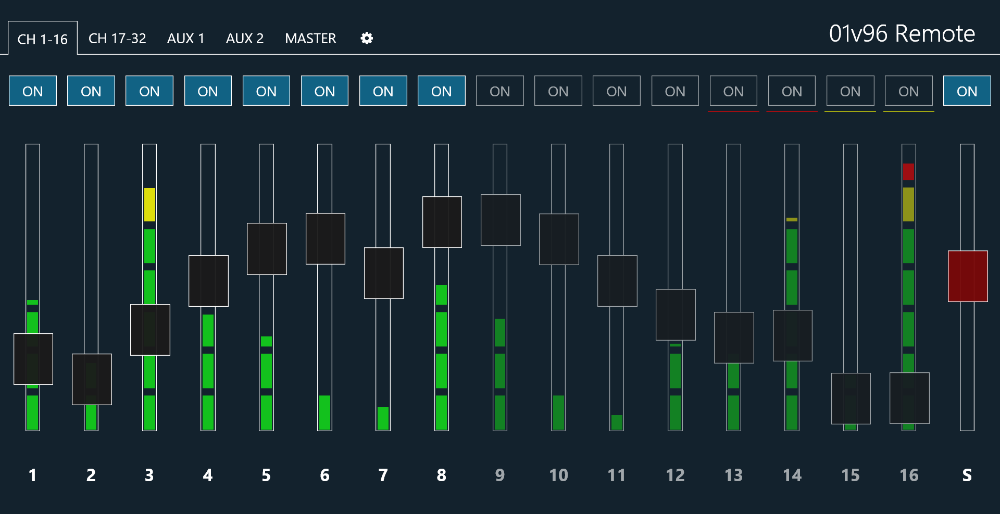

# 01v96 Remote

by Michael Strobel

> ## UNMAINTAINED
>
> This project is no longer maintained.
>
> Check out its official successor [remote-mixer](https://github.com/kryops/remote-mixer):
> - Includes all 8 AUX Sends through nested tabs
> - Syncs channel names from and to the mixer
> - Responsive / mobile-friendly
> - Light mode for outside events during the day
> - Support for mixers other than the 01v96

This application is a MIDI bridge to the Yamaha 01v96 mixing console to remote-control it over a network-based connection via WebSocket.

It is based on a node.js server and includes a web client that can be used on both mouse- and touch-based devices.

So far it has implemented

-	controlling faders for channels, aux send, master (aux and bus outputs) and stereo out
-	controlling on-buttons for channels, master and stereo out
-	Showing the meter levels of all channels
-   Configuring channel names and pairs/groups

## License

MIT

## Installation

### Installation on a PC / development environment

In order to connect the 01v96 to the PC via USB, please install the latest USB-MIDI driver from [http://www.yamahaproaudio.com/global/en/downloads/firmware_software/](http://www.yamahaproaudio.com/global/en/downloads/firmware_software/)

The node.js server can be obtained at [http://nodejs.org/](http://nodejs.org/)

Install dependencies:

	npm install

**Note for Windows users**

In order to compile the required modules, your system needs to support the python programming language and C++.

-	For python support, install the latest application (from the 2.x branch!) from [http://www.python.org/download/](http://www.python.org/download/)
-	For C++ support, install the Microsoft Visual Studio express from [http://www.microsoft.com/visualstudio/eng/downloads#d-express-windows-desktop](http://www.microsoft.com/visualstudio/eng/downloads#d-express-windows-desktop) or a similar software

**Note for Linux users**

-   If your system is ALSA based, you need to have the *libasound2-dev* package installed in order to compile the midi module.
-   make sure the *config* directory is writable for the node.JS-Server

### Installation on a Raspberry Pi

The application can be deployed to a Raspberry Pi micro computer. It can be connected via USB or configured to receive MIDI signals through its GPIO ports.

The documentation for the installation on a Raspberry Pi can be found in the file *raspberry/documentation.md*

## Usage

### 01v96 MIDI configuration

-	Press the **DIO/SETUP** button and go to the **MIDI/HOST** tab
-	In the *GENERAL* area set both *Rx PORT* and *Tx PORT* to *1*
-	Set the port type to *USB* or *MIDI* depending on how your 01v96 is connected to your server device
-	Press the **MIDI** button and go to the **SETUP** tab
-	Set both the *Tx* and *Rx CHANNEL* to *1*
-	Set *Tx* and *Rx* in the *PARAMETER CHANGE* row to *ON*, all other options to *OFF*
-	Set *Fader Resolution* to *LOW*

### NodeJS server

Start the server from the command line:

	node server.js

or

    npm run start

From Windows you can start it with the *01v96-remote-server.bat* file.

The program can only be started when the 01v96 is connected, running and configured correctly. MIDI error messages are shown in the console output.

With an optional parameter, the connection type to the mixer can be chosen:

-   **midi** *(default)* uses the standard MIDI protocol - for MIDI ports and USB connections (also on Raspberry Pi - thanks to @Shad-Rydalch)
-   **serialport** connects through the serial port on */dev/ttyAMA0* (for use with a Raspberry Pi)
-   **dummy** allows to test the application without a real mixer present. It simulates changing fader levels and a moving fader

### Web client

The web client can be accessed at port 1337. You have to use a browser that supports WebSockets. Look up browser support at [http://caniuse.com/websockets](http://caniuse.com/websockets).

## Development

### WebSocket protocol

The WebSocket service can be reached on port 1338

#### Messages sent by the server

**Fader value**

Channel groups: Message is sent for every channel

    {
        "type": "fader",
         "target": "channel" / "sum" / "auxsend" / "aux" / "bus",
         "num": < channel/aux/bus number, 0 for sum >,
         "num2": < aux number (if target is "auxsend") >
         "value": < fader value, 0-255 >
    }

**On-buttons**

Channel groups: Message is sent for every channel

    {
        "type": "on",
         "target": "channel" / "sum" / "aux" / "bus",
         "num": < channel/aux/bus number, 0 for sum >,
         "value": < true for on, false for off >
    }

**Channel meter levels**

Sent every 200ms

    {
        "type": "level",
         "levels": {
            < channel number, 1-32 >: < channel level, 0-32 >,
            // ...
         }
    }

**Complete status synchronization**

    {
        "type": "sync",
        "status": {
            "on": {
                "channel< channel number>": < boolean value >,
                "aux< aux number>": < boolean value >,
                "bus< aux number>": < boolean value >,
                "sum0": < boolean value >,
                // ...
            },
            "fader": {
                "channel< channel number>": < value 0-255 >,
                "auxsend< aux number >< channel number>": < value 0-255 >,
                "aux< aux number>": < value 0-255 >,
                "bus< aux number>": < value 0-255 >,
                "sum0": < value 0-255 >,
                // ...
            }
        }
    }

**Configuration**

    {
        "type": "config",
        "config": {
            "names": {
                "channel< channel number>": < name >,
                "aux< aux number>": < name >,
                "bus< aux number>": < name >,
                // ...
            },
            "groups": [
                [ < channel numbers in a group > ],
                // ...
            ]
        }
    }

#### Messages sent by the clients

**Request synchronization**

    {
        "type": "sync"
    }

**Request configuration**

    {
        "type": "config"
    }

**Save configuration**

Triggers a broadcast of the new configuration to all other connected clients

    {
        "type": "config_save",
        "config": {
            "names": {
                "channel< channel number>": < name >,
                "aux< aux number>": < name >,
                "bus< aux number>": < name >,
                // ...
            },
            "groups": [
                [ < channel numbers in a group > ],
                // ...
            ]
        }
    }

**Fader value**

Triggers a broadcast of the new value to all other connected clients

Channel groups: Has to be send only for one channel. Broadcast to other clients contains all channels in the group

    {
        "type": "fader",
         "target": "channel" / "sum" / "auxsend" / "aux" / "bus",
         "num": < channel/aux/bus number, 0 for sum >,
         "num2": < aux number (if target is "auxsend") >
         "value": < fader value, 0-255 >
    }

**On-button**

Triggers a broadcast of the new value to all other connected clients

Channel groups: Has to be send only for one channel. Broadcast to other clients contains all channels in the group

    {
        "type": "on",
         "target": "channel" / "sum" / "aux" / "bus",
         "num": < channel/aux/bus number, 0 for sum >,
         "value": < true for on, false for off >
    }

## Additional notes

### Third party software

NPM modules

-   uws - https://github.com/uWebSockets/uWebSockets
-   node-static - https://github.com/cloudhead/node-static
-   midi - https://github.com/justinlatimer/node-midi
-   serialport - https://github.com/voodootikigod/node-serialport

Libraries

-	jQuery - http://jquery.com/
-	FastClick - https://github.com/ftlabs/fastclick
-	Font Awesome icons - http://fortawesome.github.io/Font-Awesome/
